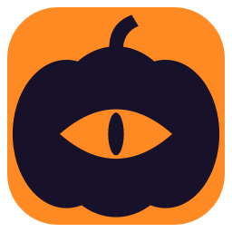

# Gourdian

A live coach for Dota 2, called Dota Trainer before 1.5. While you play it:

- **Speaks tips**: rune timings, a missing TP scroll, low HP, unspent gold, items stuck in the stash or backpack, unspent skill points, farm pace, item timing goals, Roshan and Aegis timers, and more.
- **Draws a transparent HUD** over the game — you choose where it sits, how big and see-through it is, and which lines it shows.
- **Coaches for the position you actually play**, picked with Ctrl+Shift+1…5 or worked out from the lane you stand in.
- **Helps you pick**: while you choose a hero, the heroes worth taking in your position, ranked from your own record and how each is doing at your rank, each line saying why — and, if you turn it on, weighed against the heroes the other side has taken.
- **Sets personal targets** from your own match history: last hits at each checkpoint, timings for your core items, goals for the week.
- **Asks an AI coach** for advice during the game and reviews every match afterwards. The Claude Code and Codex CLIs run on your existing subscriptions; API keys and any OpenAI-compatible server work too.
- **Runs your own rules** next to the built-in ones, built with When / If / Then cards.
- **Records every match** in its own data file and charts the trends; one click exports it all as CSV.

It reads Valve's official Game State Integration feed, which only describes your own hero. It never injects into Dota or reads game memory. The HUD is a separate click-through window, as safe as a second monitor.

If you turn on **pick help from the screen**, it also reads the ten hero portraits along the top of the game while you are choosing — the same pixels a screenshot would take, and the only way to learn who the other side picked, since Valve sends the draft to spectators and not to players. It looks only at that strip, only during the draft, and it is off until you ask for it.

## Install

Downloads are on the [Releases page](https://github.com/kireevroi/gourdian/releases): the Windows installer, the Debian package, the Linux tarball and `SHA256SUMS`.

**Windows** — run **Gourdian-Setup-\<version\>.exe**. It installs to `%LOCALAPPDATA%\Programs\Gourdian` without admin rights, adds shortcuts, can start the app when you sign in, and connects Dota 2. Upgrades close a running copy first and keep your settings and statistics, including upgrades from Dota Trainer. Uninstall from Windows Settings › Apps; you're asked whether to keep your statistics.

The build is signed with a self-signed **Gourdian** certificate ([`installer/gourdian.cer`](installer/gourdian.cer)), so SmartScreen says "Unknown publisher": choose **More info › Run anyway**. Every release file carries a GitHub attestation — `gh attestation verify Gourdian-Setup-<version>.exe --repo kireevroi/gourdian`.

**Linux** — `sudo apt install ./gourdian_<version>_amd64.deb` on Debian, Ubuntu and their derivatives, `cd packaging/arch && makepkg -si` on Arch and its derivatives, or unpack the tarball and run `./install.sh` on any distribution. See [Linux](docs/linux.md) for the in-game view and what else differs.

Then:

- Add `-gamestateintegration` to Dota 2's launch options (Steam › Dota 2 › Properties).
- Run Dota in **borderless window** mode, so the HUD can draw over it.
- For the AI coach, use **Install and connect** on the dashboard's AI page or paste an API key. The CLIs are native builds, so nothing else (no Node.js) is needed.

## Using it

The app has no window of its own; it lives in the **system tray** near the clock. Start Dota 2 (restart it if it was open during the install).

| In game | Does |
|---|---|
| **Ctrl+Shift+1…5** | Pick your position, until 2:30 |
| **Ctrl+Shift+F10** | Move and resize the HUD |
| **Ctrl+Shift+F11** | Open the dashboard |
| **Ctrl+Shift+F9** | Hide or show the HUD |

Everything else lives on the dashboard at **http://127.0.0.1:4570** — the live tip feed and pre-game briefing, charts over your statistics, rules, HUD layout, the AI coach and settings. Left-click the tray icon to open it.

## Docs

- **[Using it](docs/usage.md)** — position detection, HUD widgets, personal targets, weekly goals, troubleshooting
- **[Rules](docs/rules.md)** — retuning the built-in tips and writing your own
- **[AI coach](docs/ai-coach.md)** — providers, what gets sent, what happens when one fails
- **[Statistics](docs/stats.md)** — the data file, CSV export, match import, patch timings
- **[Linux](docs/linux.md)** — installing and what differs from Windows
- **[Development](docs/development.md)** — building, releases, commands, code map

## License

Gourdian is released under the [MIT License](LICENSE). The app includes open-source libraries, the Go runtime and the Russo One font; their licenses are collected in [THIRD_PARTY_NOTICES.txt](THIRD_PARTY_NOTICES.txt) (`make notices` regenerates it), which ships with every release.

Dota 2 is a trademark of Valve Corporation. Gourdian isn't affiliated with or endorsed by Valve; it only reads the Game State Integration feed Valve provides for third-party tools.
